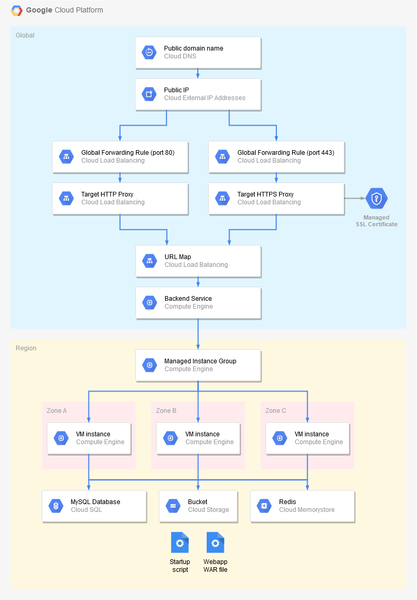

# Google Compute Engine - Classic deployment

This example uses [Compute Engine](https://cloud.google.com/compute/) to run the WAR file with a Tomcat application server in a Managed Instance Group, and [HTTPS Load Balancing](https://cloud.google.com/load-balancing/) to expose the service.

## Prerequisites

Before starting, follow the [Build](../build), [SQL](../sql) and [Memorystore](../memorystore) guides to create the WAR file, database and Redis instance.

Then, if you are _not_ going to use Terraform:
* Update the `${...}` variables in the `karaplan-startup.sh` file with appropriate values using your preferred editor. Refer to the deployment [README](../../README.md) file for information about configuring identity providers.
* In the side menu, go to **Storage > Browser**:
  * Select your bucket and enter the `karaplan` folder.
  * Click **Upload file** and select the `karaplan-startup.sh` file.

Finally, to expose the application over HTTPS, you will need to obtain a **domain name** in which you can create a **A record** pointing to a reserved IP address. If you don't have one, you may try using services from [sslip.io](https://sslip.io), [nip.io](https://nip.io) or [xip.io](http://xip.io).

## Using Cloud Console

Go to [Cloud Console](https://console.cloud.google.com) and make sure the appropriate project is selected in the header menu.

In the side menu, go to **Compute > Instance templates**:
* Click **Create instance template**.
* Enter `karaplan-classic-template-1` as the template **name**.
* Leave the default **Machine type** as `n1-standard-1` and distribution as **Debian GNU/Linux 9 (stretch)**.
* Expand the configuration options at the bottom.
* In the **Management > Automation > Metadata** section, enter `startup-script-url` as the key and `gs://YOUR_BUCKET_NAME/karaplan/karaplan-startup.sh` as the value (replace `YOUR_BUCKET_NAME` as needed).
* Click **Create**.

In the side menu, go to **Compute > Instance groups**:
* Click **Create instance group**.
* Enter `karaplan-classic-ig` as the group name.
* Select **Multiple zones** as the **Location**, then select your preferred **Region** (e.g. `europe-west1`).
* Select `karaplan-classic-template-1` as the **Instance template**.
* Set **Autoscaling** to **Off**, and set **Number of instances** to **3**.
* Click **Create**.

In the side menu, go to **Network services > Load balancing**:
* Click **Create load balancer**
* Under **HTTP(S) Load Balancing**, click **Start configuration**.
* Select **From Internet to my VMs**, then click **Continue**.
* Enter `karaplan-classic-lb` as the load balancer **name**.
* In **Backend configuration**, click the dropdown menu to select **Backend services > Create a backend service**.
  * Enter `karaplan-classic-bes` as the backend service **name**.
  * Select `karaplan-classic-ig` as the **Instance group**, `8080` as the port number, then click **Done**.
  * In **Health check**, click **Create a health check** 
    * Enter `karaplan-classic-hc` as the health check **name**.
    * Select **HTTP** as the **Protocol**, and `8080` as the port number.
    * Enter `/actuator/health/readiness` as the **Request path**.
  * Click **Create**.
* In **Frontend configuration**:
  * Enter `karaplan-classic-frontend` as the frontend service **name**.
  * In the **IP Address** dropdown, **Create IP address** named `karaplan-classic-ip`.
  * If you *don't* have a custom domain name, leave **HTTP** as the **Protocol**.
  * If you *do* have a custom domain name:
    * Select **HTTPS** as the **Protocol**.
    * In the **Certificate** dropdown, **Create a new certificate** named `karaplan-classic-ssl-cert` for your custom domain name.
  * Click **Done**.
* Click **Create**.

When the loadbalancer is created, click on it to reveal its **IP address**.
If you have a custom domain name, add this IP address in a **A record**.

After several minutes, the application should become available at this IP address and/or at the custom domain name.

## Using Cloud Shell / SDK

Use the following commands in [Cloud Shell](https://cloud.google.com/shell/) or anywhere the [Cloud SDK](https://cloud.google.com/sdk/) is installed:

    # Set variables, adjust them as needed
    PROJECT_ID=$(gcloud config get-value project)
    REGION=$(gcloud config get-value compute/region)
    BUCKET_NAME=$PROJECT_ID

    # Create Instance template
    gcloud compute instance-templates create karaplan-classic-template-1 --machine-type=n1-standard-1 --image=debian-9-stretch-v20191121 --image-project=debian-cloud --boot-disk-size=10GB --boot-disk-type=pd-standard --metadata=startup-script-url=gs://$BUCKET_NAME/karaplan/karaplan-startup.sh

    # Create Instance group
    gcloud compute instance-groups managed create karaplan-classic-ig --size=3 --template=karaplan-classic-template-1 --region=$REGION
    gcloud compute instance-groups managed set-named-ports karaplan-classic-ig --named-ports=http:8080 --region=$REGION

    # Create HTTP health check
    gcloud compute health-checks create http karaplan-classic-hc --port=8080 --request-path=/actuator/health/readiness

    # Create Backend service
    gcloud compute backend-services create karaplan-classic-bes --global --load-balancing-scheme=EXTERNAL --health-checks=karaplan-classic-hc --port-name=http --protocol=HTTP

    # Create URL map
    gcloud compute url-maps create karaplan-classic-url-map --default-service=karaplan-classic-bes

    # Create IP address
    gcloud compute addresses create karaplan-classic-ip --global
    gcloud compute addresses list

If you *don't* have a custom domain name:

    # Create Target HTTP proxy
    gcloud compute target-http-proxies create karaplan-classic-http-proxy --url-map=karaplan-classic-url-map

    # Create Forwarding rule
    gcloud compute forwarding-rules create karaplan-classic-fwd-http --global --load-balancing-scheme=EXTERNAL --target-http-proxy=karaplan-classic-http-proxy --global-address --address=karaplan-classic-ip --ports=80

If you *do* have a custom domain name, add the created IP address in a **A record**, then:

    DOMAIN=your.custom.domain

    # Create SSL certificate
    gcloud beta compute ssl-certificates create karaplan-classic-ssl-cert --domains=$DOMAIN --global

    # Create Target HTTPS proxy
    gcloud compute target-https-proxies create karaplan-classic-https-proxy --ssl-certificates=karaplan-classic-ssl-cert --url-map=karaplan-classic-url-map

    # Create Forwarding rule
    gcloud compute forwarding-rules create karaplan-classic-fwd-https --global --load-balancing-scheme=EXTERNAL --target-https-proxy=karaplan-classic-https-proxy --global-address --address=karaplan-classic-ip --ports=443

After several minutes, the application should become available at this IP address and/or at the custom domain name.

## Using Terraform

This directory contains a [Terraform](https://terraform.io) module to provision all resources automatically. See the `main.tf`, `variables.tf` and `outputs.tf` files for more information.

Please refer to the [Terraform GCE Classic Deployment](../../terraform/gce-classic) guide for a full example.

## Architecture diagram

